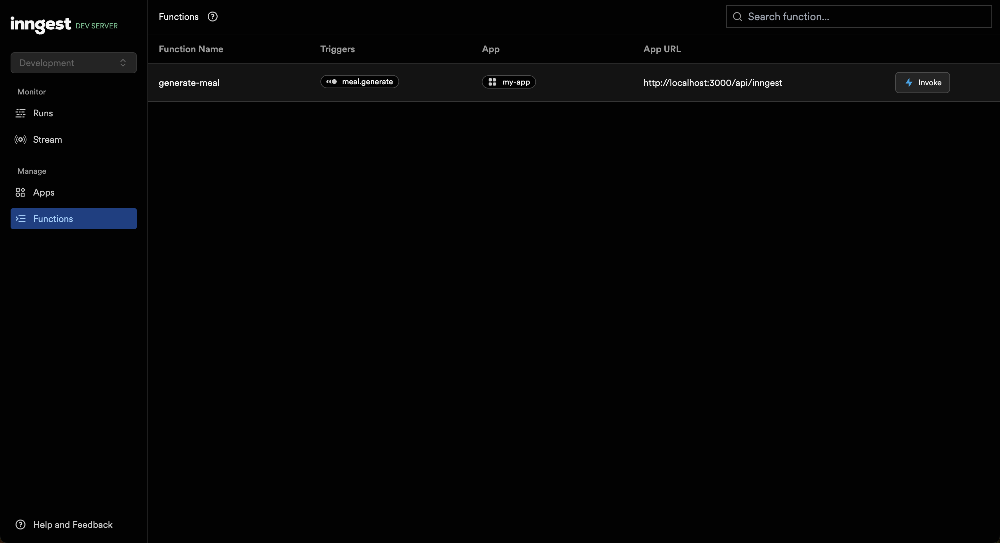
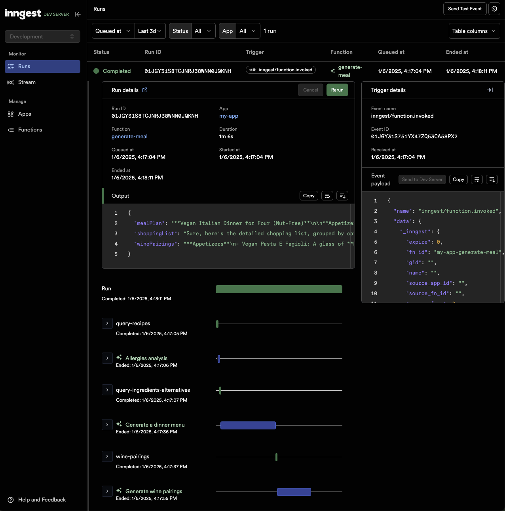

# AI Dinner Generator with Inngest and Weaviate

This project demonstrates how to build an AI-powered dinner menu generator using [Inngest](https://www.inngest.com/) and [Weaviate](https://weaviate.io/). The application uses RAG (Retrieval-Augmented Generation) to create personalized dinner menus based on cuisine preferences and dietary requirements.

## Features

- Cuisine-based recipe suggestions
- Dietary restrictions and allergies handling
- Wine pairing recommendations
- Detailed shopping list generation
- Automatic ingredient substitutions based on preferences

## Prerequisites

To run this project, you'll need:

- Node.js installed
- A [Weaviate Cloud instance](https://console.weaviate.cloud/)
- [OpenAI API key](https://platform.openai.com/api-keys)
- [Inngest account](https://www.inngest.com/?ref=weaviate-recipes-repo-dinner-generator) (_optional for local development_)

## 🌱 Setup

1. Clone the repository
2. Create a `.env` file with the following variables:

```bash
OPENAI_API_KEY=your_openai_key
WCD_URL=your_weaviate_cloud_url
WCD_API_KEY=your_weaviate_api_key
```

## 📚 Files overview

**`src/inngest/events.ts`**

This file defines the events used to trigger our workflow.

The project comes with the event later used in our example to trigger the Christmas dinner generation workflow.

Events are composed of:

- a mandatory `name`
- an optional object as `data`

The events are created with [`zod`](https://zod.dev/) and passed to the Inngest client, enabling an E2E-typed experience.

**`src/inngest/functions.ts`**

This is where our workflow is defined, using `inngest.createFunction()`.

[Inngest Functions](https://www.inngest.com/docs/features/inngest-functions?ref=weaviate-recipes-repo-dinner-generator) are composed of multiple steps, enabling you to write workflows relying on independently retriable steps.

Our first workflow is a simple example of multiple “hello worlds”.

**`src/server.ts`**

Inngest Functions are exposed to the Inngest Dev Server via a simple express server.

## 🔍 Loading Data

Load the recipe and wine pairing data into Weaviate:

```bash
npm run load
```

## 🚀 Running the Application

1. Start the Express server:

```bash
npm run start
```

2. Start the Inngest server:

```bash
npm run inngest
```

3. Open the Inngest DevServer UI at http://127.0.0.1:8288 and trigger a new runs from the _Functions_ tab using the following event data:

```json
{
  "data": {
    "participantsCount": 4,
    "preferences": ["no nuts", "vegan"],
    "cuisine_type": "Italian"
  }
}
```



Once the workflow is triggered, you can see the run in the Inngest DevServer UI.



## 📚 How it Works

1. Receives meal generation request with preferences and participant count
2. Queries relevant recipes from Weaviate based on cuisine type
3. Analyzes dietary restrictions and allergies
4. Suggests ingredient alternatives if needed
5. Generates a complete dinner menu with wine pairings
6. Creates a detailed shopping list

## 🔗 Related Links

- [Inngest Documentation](https://www.inngest.com/docs)
- [Weaviate Documentation](https://weaviate.io/developers/weaviate)
- [OpenAI Platform](https://platform.openai.com/)
